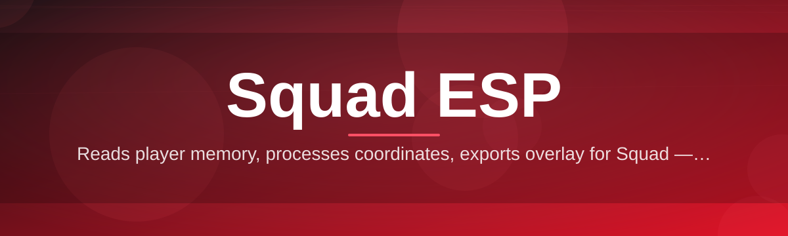
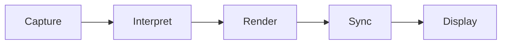

# squad-overlay-enhancer 🦅🎯

  

*A weekend-built overlay companion that turns raw Squad battlefield chaos into a readable tactical picture.*

  

---

## 📡 Overview

`squad-overlay-enhancer` started as a itch-scratching side project: a lone-dev attempt to answer the question "why doesn't my Squad HUD tell me what I actually need to know in the middle of a 60-vs-60 firefight?" What began as a scrappy weekend build has grown into a full-blown overlay toolkit purpose-built around the concept of Squad ESP — extra-sensory positional awareness layered gently on top of the game's own interface, never touching game memory or files, just reading what's already on your screen and presenting it better.

This isn't a corporate product with a roadmap dictated by a marketing team. It's an indie tool shaped entirely by feedback from the Squad community — squad leads who need faster situational reads, medics who need to spot downed teammates through smoke, and vehicle crews who need a cleaner sense of where the front line actually is. If you've ever squinted at a minimap trying to parse sixteen overlapping icons, this project exists for you.

Who is this for? Casual players who want a friendlier visual layer. Squad leaders who live and die by map awareness. Community server admins who want a transparent, screen-only overlay tool they can point their members toward with confidence. It's built to be approachable, auditable, and — most importantly — fun to keep improving. If you've got an idea for a better crosshair contrast mode or a smarter callout label, there's a good-first-issue tag waiting for you.

---

## 🧩 What This Little Tool Actually Does

> [!NOTE]
> Every capability below reads the screen layer only — nothing here reaches into game memory, process handles, or save files.

- **Contrast-Aware Overlay Rendering** — dynamically re-tunes overlay opacity based on the scene behind it, so callouts stay legible whether you're in a sunny wheat field or a smoke-choked compound.

- **Distance-Sorted Label Stacking** — instead of a pile of overlapping icons, labels stack by proximity so the closest, most actionable information sits on top.

- **Squad-Colored Grouping** — teammates, squads, and vehicles get consistent color coding across sessions, so your brain builds muscle memory instead of re-learning icons every match.

- **Low-Profile Compass Ribbon** — a slim rotating heading strip along the top edge, designed to answer "which way am I actually facing" without stealing screen real estate.

- **Adaptive Refresh Throttling** — the overlay backs off its redraw rate during calm moments and ramps up during firefights, keeping frame impact minimal.

- **One-Click Theme Swap** — flip between Tactical Dark, High-Vis Desert, and Night-Ops Blue instantly, no restart required.

- **Session Snapshot Export** — save a PNG of your current overlay state for after-action reviews or squad Discord debriefs.

- **Hotkey-Driven Everything** — every toggle, from opacity to label density, is bound to a key you control.

---

## 🚀 Getting In The Game

1. Visit the landing page linked above and grab the latest build for Windows.

2. Extract the downloaded folder anywhere — no installer wizard, no registry changes.

3. Launch `squad-overlay-enhancer.exe` before or after starting Squad; it layers on top automatically.

4. Press the default hotkey to toggle the overlay, tune your theme, and drop into the server.

> [!TIP]
> Run it once in an empty menu screen first to get comfortable with the hotkeys before jumping into a live match.

---

## 🖥️ Requirements Matrix

| Component | Minimum | Recommended |
|---|---|---|
| **OS** | Windows 10 (64-bit) | Windows 11 (64-bit) |
| **RAM** | 4 GB | 8 GB+ |
| **Disk** | 150 MB free | 300 MB free |

> [!IMPORTANT]
> This is a standalone executable — there are no external dependencies to install, no runtimes to chase down, and nothing to compile. Download, extract, run.

---

## ⚙️ How It Works

The overlay pipeline is intentionally simple, which is a big part of why it stays lightweight:

1. **Capture** — a screen-layer hook grabs the current frame composition data.

2. **Interpret** — positional and label data is parsed into a lightweight internal map.

3. **Render** — the enhancer draws its overlay layer on top, respecting transparency rules.

4. **Sync** — the loop re-runs on the adaptive refresh timer described above.

5. **Display** — you see a cleaner, faster-to-read tactical picture in real time.

---

## 🔧 Troubleshooting Corner

<strong>The overlay won't appear over my game window.</strong>

Make sure Squad is running in Borderless Windowed or Windowed mode. True exclusive Fullscreen can prevent overlay composition on some GPU drivers.

<strong>My frame rate dipped after enabling label stacking.</strong>

Try switching Adaptive Refresh Throttling to "Aggressive" in Settings — it trades a small amount of label update latency for smoother frames during heavy combat.

<strong>Colors look washed out on my monitor.</strong>

Switch to the High-Vis Desert theme, or manually bump contrast in the Display tab — HDR monitors sometimes need a manual recalibration pass.

<strong>The compass ribbon is misaligned.</strong>

This usually means your in-game FOV setting changed after the overlay launched. Restart the enhancer after adjusting FOV in Squad's video settings.

<strong>Can I run this on a second monitor setup?</strong>

Yes — the overlay follows whichever display Squad is rendering to, and hotkeys work globally regardless of active window focus.

---

## 🎨 UI, UX & Little Details

| Action | Default Key |
|---|---|
| Toggle Overlay | `F8` |
| Cycle Theme | `F9` |
| Increase Label Density | `F10` |
| Decrease Label Density | `F11` |
| Snapshot Export | `F12` |

- Themes: **Tactical Dark**, **High-Vis Desert**, **Night-Ops Blue**

- Settings persist automatically between sessions in a local config file

- All hotkeys are fully rebindable through the Settings panel

> [!WARNING]
> Rebinding a hotkey to a key already used by Squad itself can cause double-triggers. Test new bindings in the main menu first.

---

## 🤝 Contributing & Community

This project runs on the classic indie open-source spirit: small PRs, friendly reviews, and a genuine appreciation for first-time contributors.

- Check the `good-first-issue` label if you're new — these are scoped to be approachable

- Discussions tab is open for feature ideas and theme suggestions

- Bug reports with a screenshot and your Squad server settings are gold

> [!TIP]
> Even a typo fix in this README counts as a contribution. Every PR gets a real human review, usually within a day or two.

---

## 📜 License

Released under the [MIT License](LICENSE), 2026. Do good things with it.

---

## ⚠️ Disclaimer

`squad-overlay-enhancer` is an independent, community-built overlay tool. It is not affiliated with, endorsed by, or associated with Offworld Industries or the official Squad development team. It operates purely at the screen-display layer and does not modify game files, memory, or network traffic. Use in accordance with the terms of service of any server or platform you play on — server admins may set their own policies regarding overlay tools.

---

